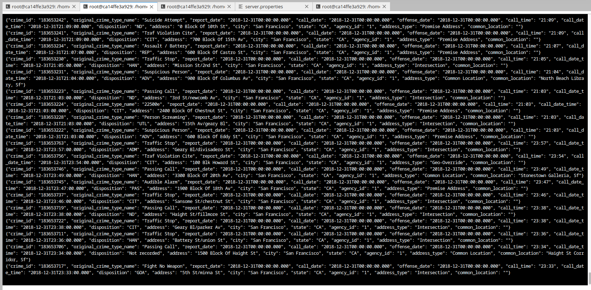
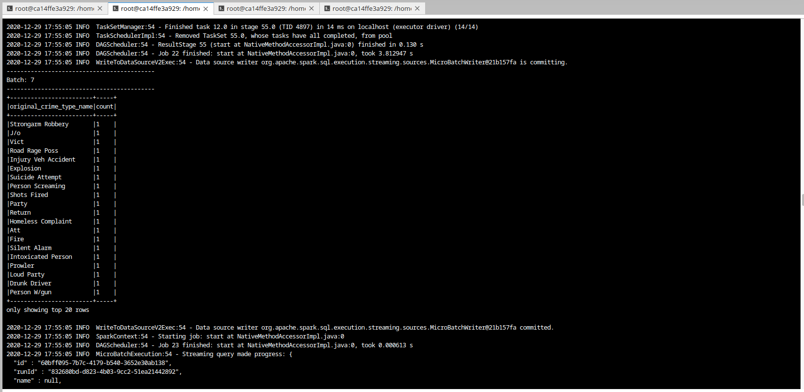
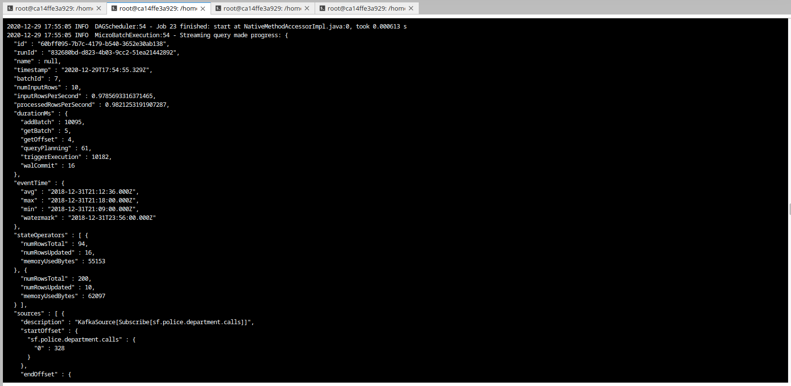
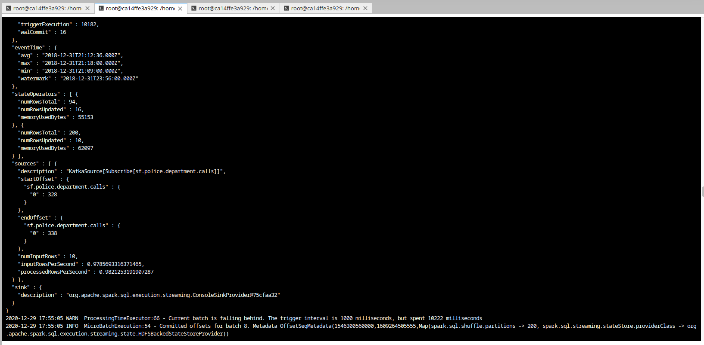
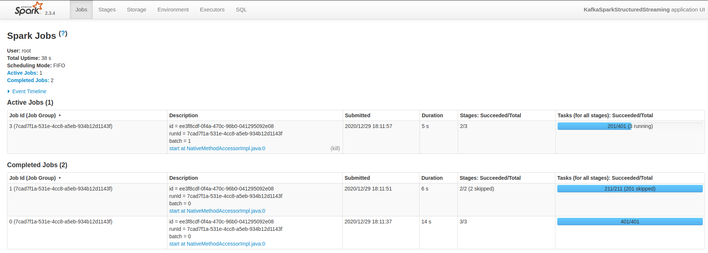
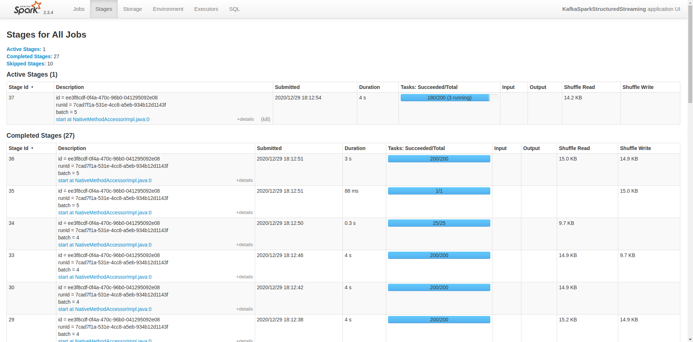

# SF Crime Statistics with Spark Streaming

Analyses of a real-world dataset of the SF Crime Rate to provide statistical analysis using Apache Spark Structured Streaming.

## Results

### Step 1
-> Kafka console consumer output

### Step 2
-> Spark progress reporter 

-> Spark UI

### Step 3

1. How did changing values on the SparkSession property parameters affect the throughput and latency of the data?
-> Processing time can be reduced by specifying more driver `spark.driver.memory`/ executor `spark.executor.memory` memory.
-> Parallelism can be increased by specifying more driver `spark.driver.cores`/ executor `spark.executor.cores` cores or by increasing the default parallelism `spark.default.parallelism`. Although, the total throughput is higher, increased network overhead has to be considered.

2. What were the 2-3 most efficient SparkSession property key/value pairs? Through testing multiple variations on values, how can you tell these were the most optimal?
-> Tweaking driver and executor memory resulted in the best performances. The parallelism default configurations were just fine and did not increase speed as much. 